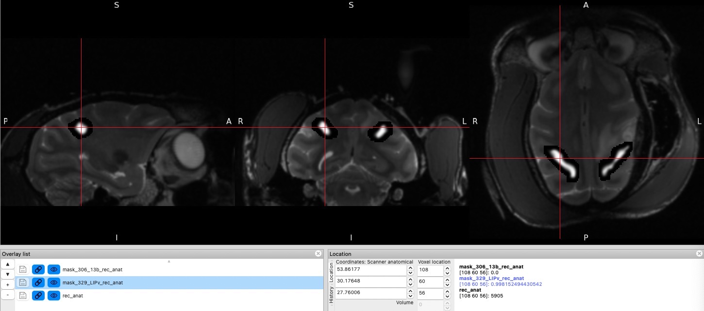
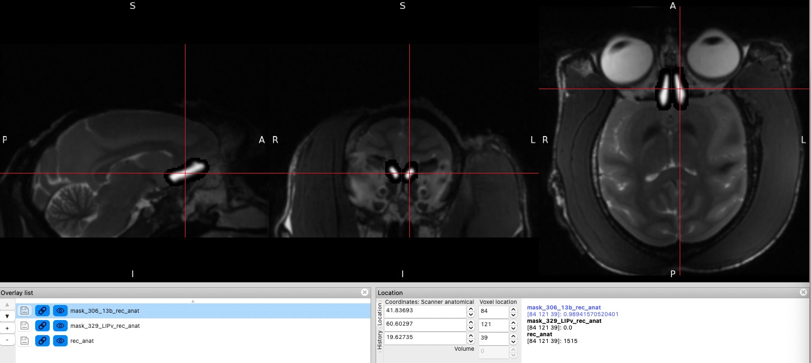

# NailMonkey
 Generate mask of an individual macaque monkey through [NIMH D99 Atlas](https://afni.nimh.nih.gov/pub/dist/doc/htmldoc/nonhuman/macaque_tempatl/atlas_d99v2.html)
 Note that the template inside D99 is as same as the Saleem & Logotheis atlas book: [A Combined MRI and Histology Atlas of the Rhesus Monkey](https://www.amazon.com/Combined-Histology-Rhesus-Stereotaxic-Coordinates-ebook/dp/B008S8TAH0)

# Installation

- [install FSL](https://fsl.fmrib.ox.ac.uk/fsl/fslwiki/FslInstallation)
- [install nipype](https://nipype.readthedocs.io/en/latest/users/install.html) (might be not necessary in the future)
- Atlas (D99 is already embedded in the program)

# Example
The example file is taken from [PRIME-MRM](https://osf.io/mhgs8) dataset Newcastle_prime-mrm/0000001/session_1/anat_1/.

The `DICOM` images should be transformed into nii file first.
If you are using Ubuntu, you can use `dcm2nii` to do the job.

`sudo apt install dcm2nii`

`run.py` file gives an example code to run a dataset contained in `./data_example/anta.nii`

OFC 13b (306) and LIPv (329) are shown here.

Several files are generated:
- `rec_anta.nii.gz` orientation rectified nii file in rectified original space
- `bet_rec_anta.nii.gz` brain extracted orientation rectified nii file in rectified original space
- `tpl_bet_rec_anta.nii.gz` brain extracted orientation rectified nii file in D99 template space
- `mask_306_13b_rec_anat.nii.gz` mask of the OFC 13b area in rectified original space
- `mask_329_LIPv_rec_anat.nii.gz` mask of the OFC 13b area in rectified original space
- `tpl_bet_rec_anat.mat` the transformation matrix from the rectified original space to template space 
- `tpl_bet_rec_anat_inv.mat` the transformation matrix from the template space to rectified original space 

## Figures
- LIPv 
- OFC 13b 

# Atlas
You can use other atlas but it means you need to deeply modify the program. `Atlas_generation.ipynb` is used to generate files in `D99_mask`.

# Current Issues

- The auto orientation detection is not correct for now, you need try different orientations using `dims` option in `ProcessNiiFile` function.
- Only tested in macOS Monterey 12.5 with zsh